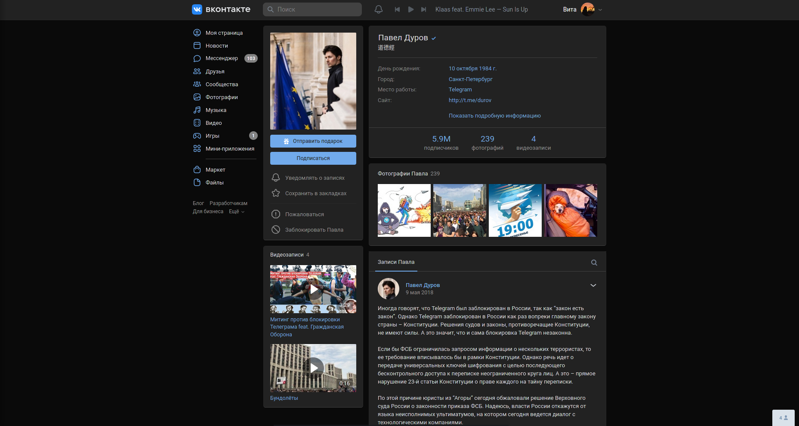
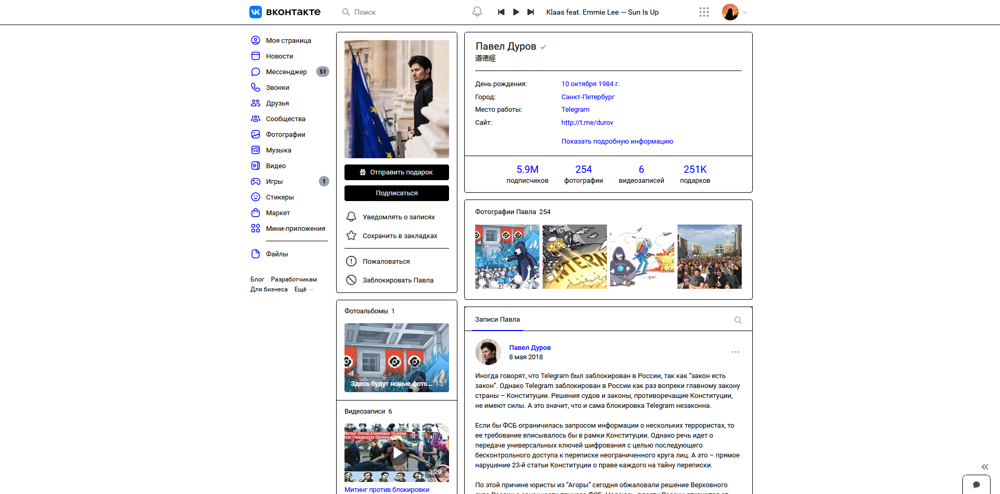
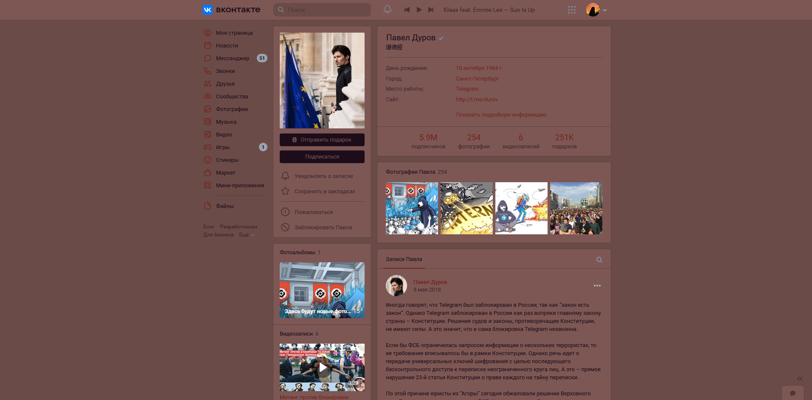
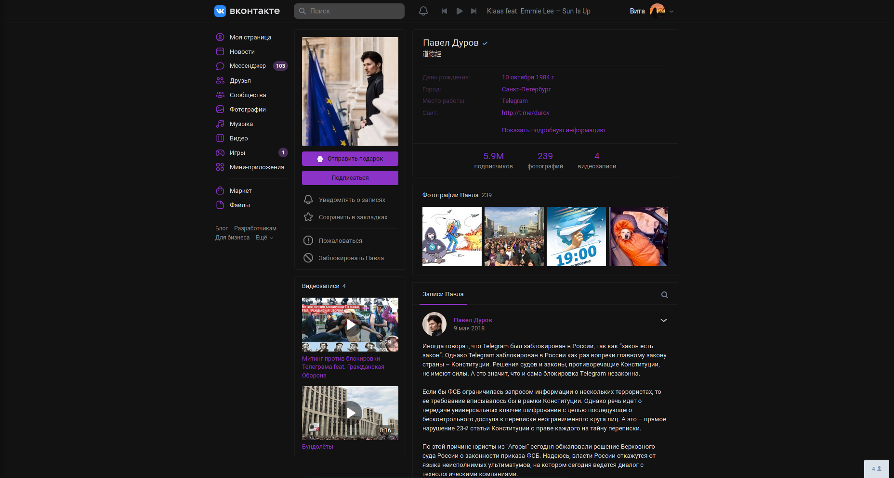
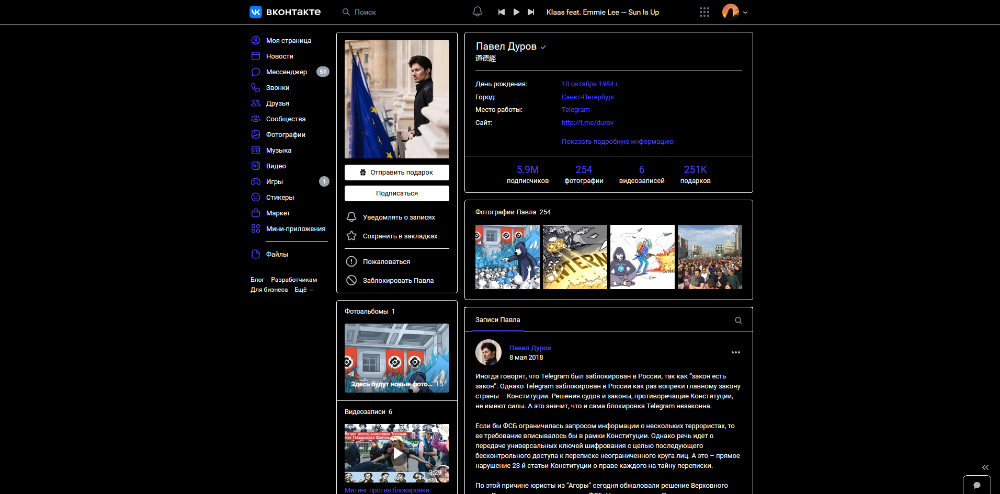

# VK Schemes

Набор цветовых схем для vk.com + небольшие настройки для сайта.  
Для покраски используются переменные с сайта (и только переменные).

## Установка

1. Установить менеджер стилей с поддержкой UserCSS (желательно, [Stylus](https://github.com/openstyles/stylus/)):

    - [Firefox](https://addons.mozilla.org/firefox/addon/styl-us/)
    - [Opera](https://addons.opera.com/extensions/details/stylus/)
    - [Chrome/Chromium/Яндекс/etc](https://chrome.google.com/webstore/detail/stylus/clngdbkpkpeebahjckkjfobafhncgmne)

2. Выбрать схему (кликнуть на нужный скриншот из списка ниже)

## Схемы
<ul> 

<li>

    
<b>VKCOM Light</b>: Стандартная светлая тема ВКонтакте

Варианты:

<ul>

<li>

    
<b>VKCOM Light Alternate Buttons</b>: Вариант VKCOM Light с инвертированными цветами кнопок (цвет текста и фона кнопки поменяны местами)

</li>

</ul>

</li>

<li>

    
<b>VKCOM Dark</b>: Стандартная тёмная тема ВКонтакте

Варианты:

<ul>

<li>

    
<b>VKCOM Dark Alternate Buttons</b>: Вариант VKCOM Dark с инвертированными цветами кнопок (цвет текста и фона кнопки поменяны местами)

</li>

</ul>

</li>

<li>

    
<b>Mono</b>: Высококонтрастная светлая схема

Варианты:

<ul>

<li>

    
<b>Mono Alternate Buttons</b>: Вариант Mono с инвертированными цветами кнопок (цвет текста и фона кнопки поменяны местами)

</li>

</ul>

</li>

<li>

    
<b>Ayu</b>: Темная схема, основанная на цветах <a href="https://github.com/dempfi/ayu">dempfi/ayu</a> - темы для Sublime Text

Варианты:

<ul>

<li>

    
<b>Ayu Alt</b>: Контрастный вариант Ayu

Варианты:

<ul>

<li>

    
<b>Ayu Alt Alternate Buttons</b>: Вариант Ayu Alt с инвертированными цветами кнопок (цвет текста и фона кнопки поменяны местами)

</li>

</ul>

</li>

<li>

    
<b>Ayu Alternate Buttons</b>: Вариант Ayu с инвертированными цветами кнопок (цвет текста и фона кнопки поменяны местами)

</li>

</ul>

</li>

<li>

    
<b>Windswept</b>: Блекло-красная схема

Варианты:

<ul>

<li>

    
<b>Windswept Alternate Buttons</b>: Вариант Windswept с инвертированными цветами кнопок (цвет текста и фона кнопки поменяны местами)

</li>

</ul>

</li>

<li>

    
<b>WTF</b>: Отличная схема, приятная глазу

Варианты:

<ul>

<li>

    
<b>WTF Alternate Buttons</b>: Вариант WTF с инвертированными цветами кнопок (цвет текста и фона кнопки поменяны местами)

</li>

</ul>

</li>

<li>

    
<b>Firefox Alpenglow</b>: Темная схема, основанная на цветах <a href="https://addons.mozilla.org/en-US/firefox/addon/firefox-alpenglow/">Firefox Alpenglow</a> - темы для Firefox

Варианты:

<ul>

<li>

    
<b>Firefox Alpenglow Borderless</b>: Вариант Alpenglow без яркой обводки

Варианты:

<ul>

<li>

    
<b>Firefox Alpenglow Borderless Alternate Buttons</b>: Вариант Firefox Alpenglow Borderless с инвертированными цветами кнопок (цвет текста и фона кнопки поменяны местами)

</li>

</ul>

</li>

<li>

    
<b>Firefox Alpenglow Alternate Buttons</b>: Вариант Firefox Alpenglow с инвертированными цветами кнопок (цвет текста и фона кнопки поменяны местами)

</li>

</ul>

</li>

<li>

    
<b>Mold</b>: Тёмно-бирюзовая схема

Варианты:

<ul>

<li>

    
<b>Mold Alternate Buttons</b>: Вариант Mold с инвертированными цветами кнопок (цвет текста и фона кнопки поменяны местами)

</li>

</ul>

</li>

<li>

    
<b>Dracula</b>: Темная схема, основанная на <a href="https://draculatheme.com">draculatheme.com</a>

Варианты:

<ul>

<li>

    
<b>Dracula Contrast</b>: Контрастный вариант Dracula

Варианты:

<ul>

<li>

    
<b>Dracula Contrast Alternate Buttons</b>: Вариант Dracula Contrast с инвертированными цветами кнопок (цвет текста и фона кнопки поменяны местами)

</li>

</ul>

</li>

<li>

    
<b>Dracula Alternate Buttons</b>: Вариант Dracula с инвертированными цветами кнопок (цвет текста и фона кнопки поменяны местами)

</li>

</ul>

</li>

<li>

    
<b>Yandex.Music</b>: Темная схема, основанная на тёмной теме <a href="https://music.yandex.ru">Яндекс.Музыки</a>

Варианты:

<ul>

<li>

    
<b>Yandex.Music Contrast</b>: Контрастный вариант Yandex.Music

Варианты:

<ul>

<li>

    
<b>Yandex.Music Contrast Alternate Buttons</b>: Вариант Yandex.Music Contrast с инвертированными цветами кнопок (цвет текста и фона кнопки поменяны местами)

</li>

</ul>

</li>

<li>

    
<b>Yandex.Music Alternate Buttons</b>: Вариант Yandex.Music с инвертированными цветами кнопок (цвет текста и фона кнопки поменяны местами)

</li>

</ul>

</li>

<li>

    
<b>Leaf</b>: Красно-зеленая (да, на любителя) светлая схема

Варианты:

<ul>

<li>

    
<b>Leaf Alternate Buttons</b>: Вариант Leaf с инвертированными цветами кнопок (цвет текста и фона кнопки поменяны местами)

</li>

</ul>

</li>

<li>

    
<b>Acid Dark</b>: Тёмная схема с ярко-фиолетовым акцентом

Варианты:

<ul>

<li>

    
<b>Acid Dark Alternate Buttons</b>: Вариант Acid Dark с инвертированными цветами кнопок (цвет текста и фона кнопки поменяны местами)

</li>

</ul>

</li>

<li>

    
<b>Monodark</b>: Высококонтрастная тёмная схема

Варианты:

<ul>

<li>

    
<b>Monodark Alternate Buttons</b>: Вариант Monodark с инвертированными цветами кнопок (цвет текста и фона кнопки поменяны местами)

</li>

</ul>

</li>

<li>

    
<b>Ocean</b>: Тёмно-синяя схема с голубым акцентом

Варианты:

<ul>

<li>

    
<b>Ocean Alternate Buttons</b>: Вариант Ocean с инвертированными цветами кнопок (цвет текста и фона кнопки поменяны местами)

</li>

</ul>

</li>

<li>

    
<b>Monokai</b>: Темная схема, основанная на цветах <a href="https://monokai.pro/">Monokai Pro</a> - темы для Sublime Text и VS Code

Варианты:

<ul>

<li>

    
<b>Monokai</b>: Вариант Monokai с красным акцентом

Варианты:

<ul>

<li>

    
<b>Monokai Alternate Buttons</b>: Вариант Monokai с инвертированными цветами кнопок (цвет текста и фона кнопки поменяны местами)

</li>

</ul>

</li>

<li>

    
<b>Monokai</b>: Вариант Monokai с синим акцентом

Варианты:

<ul>

<li>

    
<b>Monokai Alternate Buttons</b>: Вариант Monokai с инвертированными цветами кнопок (цвет текста и фона кнопки поменяны местами)

</li>

</ul>

</li>

<li>

    
<b>Monokai Alternate Buttons</b>: Вариант Monokai с инвертированными цветами кнопок (цвет текста и фона кнопки поменяны местами)

</li>

</ul>

</li>

<li>

    
<b>Mold Alt</b>: Вариант Mold с бежевым акцентом

Варианты:

<ul>

<li>

    
<b>Mold Alt Alternate Buttons</b>: Вариант Mold Alt с инвертированными цветами кнопок (цвет текста и фона кнопки поменяны местами)

</li>

</ul>

</li>

</ul>
## Настройки стиля

В 1.0.7 во все схемы были добавлены настройки из [VK Tweaks](https://github.com/evtn/vk-tweaks).
Чтобы их использовать, нужно зайти на vk.com, нажать на значок Stylus в панели браузера и открыть настройки стиля.

Список настроек:

-   Скрытие рекламы слева
-   Скрытие историй в новостях
-   Скрытие недавно посещенных сообществ
-   Настраиваемое скругление аватарок
-   Название пункта 'Мессенджер' в левом меню
-   Внешний вид счётчиков слева
-   Изменение регистра текста (например, можно сделать весь текст БОЛЬШИМ)
-   Бесплатная поездка в Италию
-   Скрытие миничатов

## Добавление своих схем

Чтобы добавить свою схему:  
(Шаги 3-4 нужно выполнять из корня репозитория)

1. Скопируйте репозиторий.
2. Добавьте схему в `build/schemes` (подробнее о структуре схем в [`build/readme.md`](build/readme.md))
3. Запустите `build/builder.py` для сборки схем.
4. Проверьте работоспособность собранной схемы (в папке `styles`).
5. Сделайте PR.
