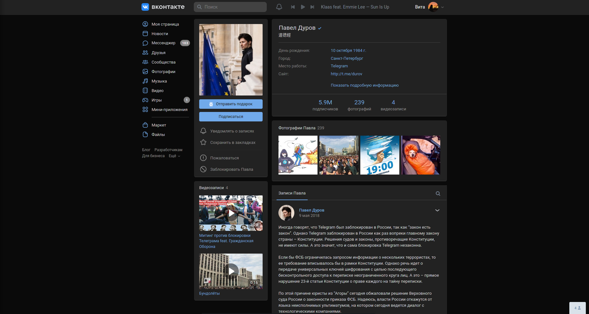
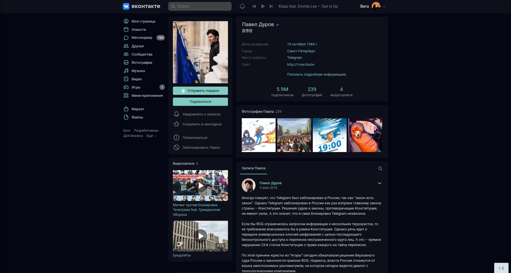
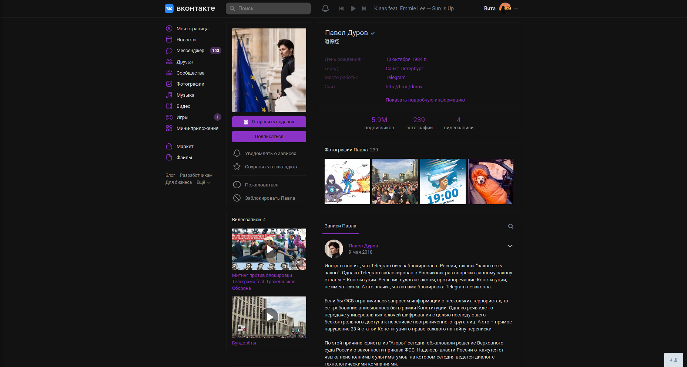
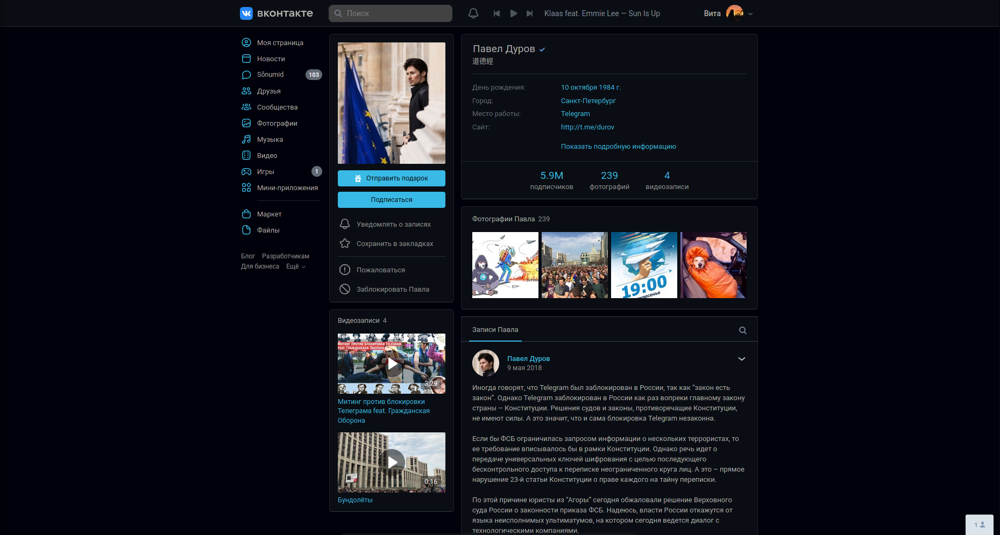

# VK Schemes

Набор цветовых схем для vk.com + небольшие настройки для сайта.    
Для покраски используются переменные с сайта (и только переменные).    
На момент написания этого текста, многие элементы не были прокрашены, поэтому схемы могут выглядеть незаконченными (особенно темные).    

## Установка

1. Установить менеджер стилей с поддержкой UserCSS (желательно, [Stylus](https://github.com/openstyles/stylus/)):
    - [Firefox](https://addons.mozilla.org/firefox/addon/styl-us/)
    - [Opera](https://addons.opera.com/extensions/details/stylus/)
    - [Chrome/Chromium/Яндекс/etc](https://chrome.google.com/webstore/detail/stylus/clngdbkpkpeebahjckkjfobafhncgmne)

2. Выбрать схему (скриншоты и описание ниже) и перейти по соответствующей ссылке:
    - [vk.com Light](https://github.com/evtn/vk-schemes/raw/build-stable/vk-default-scheme.user.css) (стандартная тема с мелкими изменениями)
    - [vk.com Dark](https://github.com/evtn/vk-schemes/raw/build-stable/vk-dark-scheme.user.css)
    - [Ocean](https://github.com/evtn/vk-schemes/raw/build-stable/vk-ocean-scheme.user.css)
    - [Acid Dark](https://github.com/evtn/vk-schemes/raw/build-stable/vk-acid_dark-scheme.user.css)
    - [Leaf](https://github.com/evtn/vk-schemes/raw/build-stable/vk-leaf-scheme.user.css)
    - [Ayu](https://github.com/evtn/vk-schemes/raw/build-stable/vk-ayu-scheme.user.css)

## Скриншоты

VKCOM Dark: Официальная темная схема    
    

Ocean: Тёмно-синяя схема с голубым акцентом    
    

Acid Dark: Тёмная схема с ярко-фиолетовым акцентом
    

Leaf: Красно-зеленая (да, на любителя) светлая схема    
    

Ayu: Темная схема, основанная на цветах [dempfi/ayu](https://github.com/dempfi/ayu) - темы для Sublime Text    
    

## Настройки стиля

В 1.0.7 во все схемы были добавлены настройки из [VK Tweaks](https://github.com/evtn/vk-tweaks).
Чтобы их использовать, нужно зайти на vk.com, нажать на значок Stylus в панели браузера и открыть настройки стиля.    

## Добавление своих схем

Чтобы добавить свою схему:    
(Шаги 3-4 нужно выполнять из корня репозитория)    

1. Скопируйте репозиторий.    
2. Добавьте схему в `build/schemes.json` (подробнее о структуре схем в [`build/readme.md`](build/readme.md))    
3. Запустите `build/optimizer.py` для очистки лишних переменных.    
4. Запустите `build/builder.py` для сборки схем.    
5. Скопируйте содержимое вашей собранной схемы из соотсветствующего файла в папке `styles` и проверьте ее работоспособность.    
6. Удалите собранные схемы и делайте PR.    