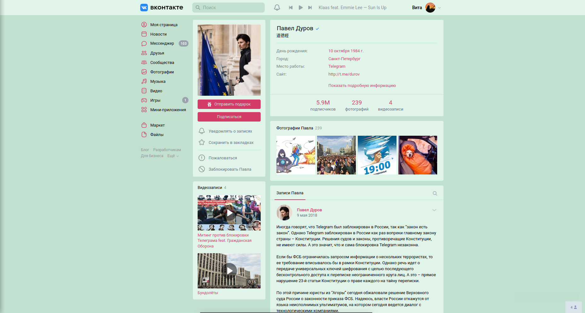
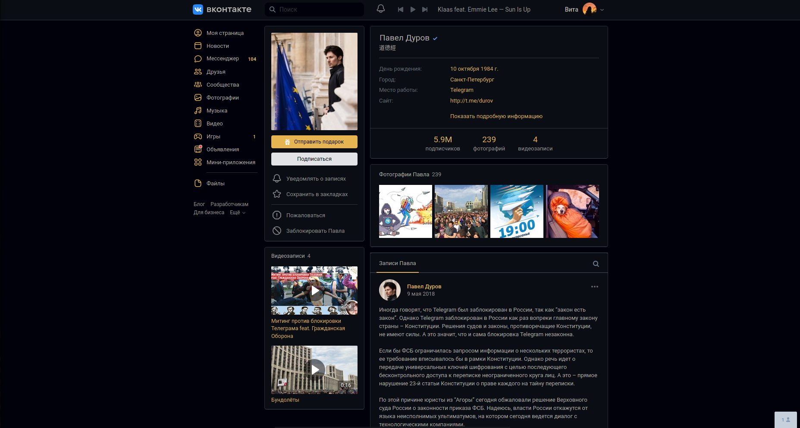
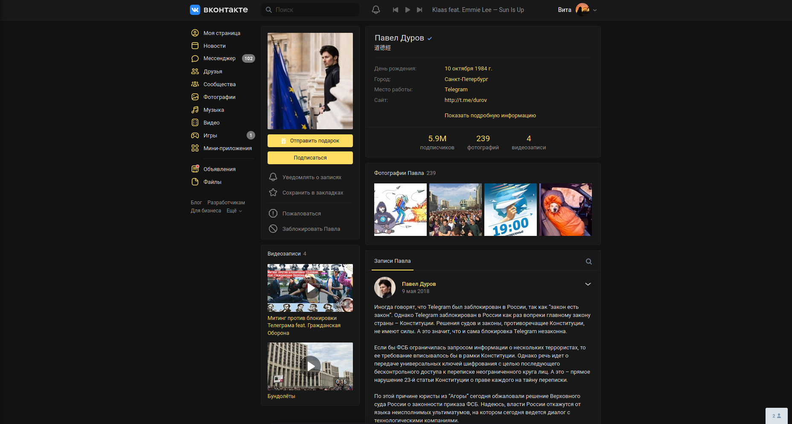

# VK Schemes

Набор цветовых схем для vk.com + небольшие настройки для сайта.    
Для покраски используются переменные с сайта (и только переменные).    
На момент написания этого текста, многие элементы не были прокрашены, поэтому схемы могут выглядеть незаконченными (особенно темные).    

## Установка

1. Установить менеджер стилей с поддержкой UserCSS (желательно, [Stylus](https://github.com/openstyles/stylus/)):
    - [Firefox](https://addons.mozilla.org/firefox/addon/styl-us/)
    - [Opera](https://addons.opera.com/extensions/details/stylus/)
    - [Chrome/Chromium/Яндекс/etc](https://chrome.google.com/webstore/detail/stylus/clngdbkpkpeebahjckkjfobafhncgmne)

2. Выбрать схему (кликнуть на нужный скриншот из списка ниже)

## Фикс непрокрасов

Сделал небольшую заплатку, которая вешает переменные на некоторые особо неприятные места.    
Для установки перейдите [по этой ссылке](https://github.com/evtn/vk-schemes/raw/lord/build/vk-tempfix.user.css) после установки основного стиля.

## Схемы
*многие темы имеют альтернативные вариации, они находятся в самом низу списка*

    
<b>VKCOM Dark</b>: Официальная темная схема    

        

    
<b>Ocean</b>: Тёмно-синяя схема с голубым акцентом    

        

    
<b>Acid Dark</b>: Тёмная схема с ярко-фиолетовым акцентом

        

    
<b>Leaf</b>: Красно-зеленая (да, на любителя) светлая схема    

        

    
<b>Ayu</b>: Темная схема, основанная на цветах [dempfi/ayu](https://github.com/dempfi/ayu) - темы для Sublime Text    

    

    
<b>Alpenglow</b>: Темная схема, основанная на цветах [Firefox Alpenglow](https://addons.mozilla.org/en-US/firefox/addon/firefox-alpenglow/) - темы для Firefox    

    

    
<b>Dracula</b>: Темная схема, основанная на [draculatheme.com](https://draculatheme.com)

    

    
<b>Yandex.Music</b>: Темная схема, основанная на тёмной теме [Яндекс.Музыки](https://music.yandex.ru)

    

    
<b>WTF</b>: Отличная схема, приятная глазу    

        

### Варианты

    
<b>Ayu Alternate</b>: Вариант Ayu с синим акцентом    

    

    
<b>Alpenglow Borderless</b>: Вариант Alpenglow без яркой обводки

    

    
<b>Dracula Contrast</b>: Контрастный вариант Dracula    

    

    
<b>Yandex.Music Contrast</b>: Контрастный вариант Yandex.Music    

    

## Настройки стиля

В 1.0.7 во все схемы были добавлены настройки из [VK Tweaks](https://github.com/evtn/vk-tweaks).
Чтобы их использовать, нужно зайти на vk.com, нажать на значок Stylus в панели браузера и открыть настройки стиля.    

Список настроек:
- Скрытие рекламы слева    
- Скрытие историй в новостях    
- Скрытие недавно посещенных сообществ    
- Настраиваемое скругление аватарок    
- Название пункта 'Мессенджер' в левом меню    
- Внешний вид счётчиков слева    
- Изменение регистра текста (например, можно сделать весь текст БОЛЬШИМ)    
- Бесплатная поездка в Италию    
- Скрытие миничатов    

## Добавление своих схем

Чтобы добавить свою схему:    
(Шаги 3-4 нужно выполнять из корня репозитория)    

1. Скопируйте репозиторий.    
2. Добавьте схему в `build/schemes.json` (подробнее о структуре схем в [`build/readme.md`](build/readme.md))    
3. Запустите `build/optimizer.py` для очистки лишних переменных.    
4. Запустите `build/builder.py` для сборки схем.    
5. Проверьте работоспособность собранной схемы (в папке `styles`).    
6. Удалите собранные схемы и делайте PR.    